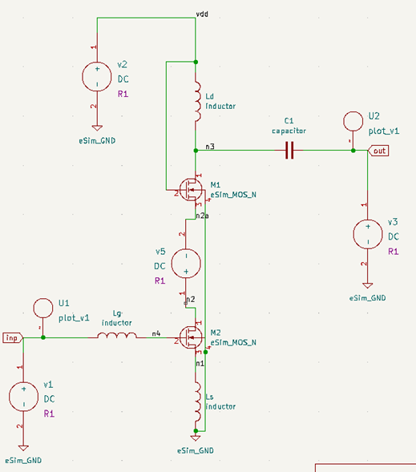
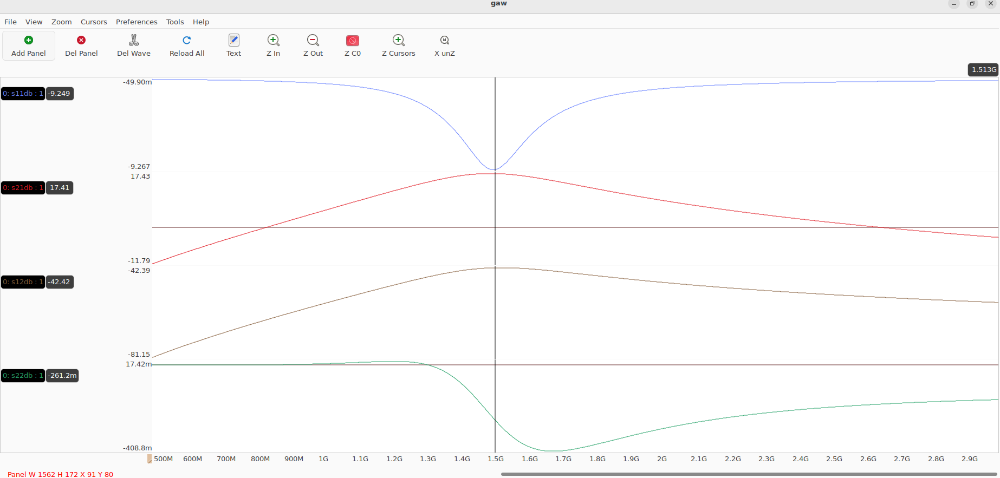

# 📡 Single-Stage Common-Source Cascode LNA Design at 1.5 GHz

---

## 1. Introduction
Low Noise Amplifiers (LNAs) are critical components in RF receiver front-ends, determining overall system sensitivity.  
This project focuses on designing and simulating a **single-stage common-source cascode LNA** at **1.5 GHz** using **IHP SG13G2 technology** with **open-source tools (eSim + Ngspice)**.

### 1.1 Objective
Design and simulate a **low-noise, high-gain LNA** with proper input/output matching and low power consumption.

---

## 2. Project Overview
> “Single Stage Common Source Cascode LNA Design at 1.5 GHz”  
> submitted for the **eSim Marathon – Circuit Design and Simulation with IHP SG13G2.**

The **cascode topology** improves gain and isolation while reducing Miller capacitance.  
**Inductive source degeneration** provides 50 Ω matching, and the **load inductor** ensures resonance at 1.55 GHz.

---

## 3. Circuit Design

### 3.1 Circuit Description
- M1: Common-source transistor  
- M2: Cascode transistor  
- Lg: Gate inductor  
- Ls: Source degeneration inductor  
- Ld: Load inductor  
- Cp: AC coupling capacitor  

### 3.2 Circuit Schematic

**Figure 1:** Common-source cascode LNA schematic implemented in eSim.

---

## 4. Simulation and Results

### 4.1 Simulation Setup
Simulations performed in **Ngspice** using **IHP SG13G2 PDK** via **eSim**.  
Manual netlist modifications were required for S-parameter analysis since eSim lacks direct RF support.

To visualize results, **GAW** was used instead of GTKWave due to its S-parameter plotting capability.

---

### 4.2 Results

| **Parameter** | **Typical Specification** | **Simulation Result** |
|:--------------|:--------------------------|:----------------------|
| Frequency Band | 1.55 – 1.60 GHz | 1.55 GHz |
| Gain (S21) | 20 dB | 17.4 dB |
| Noise Figure (NF) | < 2 dB | Not simulated |
| Input Return Loss (S11) | < –10 dB | –9.2 dB |
| Output Return Loss (S22) | < –10 dB | –0.4 dB |
| Reverse Isolation (S12) | < –30 dB | –42 dB |
| P1dB | –15 to –10 dBm | Not simulated |
| Power Consumption | < 10 mW | 0.42 mW |
| Supply Voltage | 1.8 V | 3.3 V |

**Figure 2:** Simulated S-parameter response of the designed LNA.

---

## 5. Discussion
The LNA achieved **17.4 dB gain** and **excellent reverse isolation (–42 dB)**.  
Minor **input mismatch (S11)** and poor **output matching (S22)** can be fixed with a refined Ls–Cp network.  
Power draw was exceptionally low (**0.42 mW**).  
**NF and P1dB** were not simulated due to Ngspice limitations.

---

## 6. Conclusion
A **1.5 GHz single-stage cascode LNA** was successfully designed and simulated using open-source tools.  
It achieved:
- High gain  
- Strong isolation  
- Very low power use  

Further matching optimization and improved open-source tool capabilities would enable full RF characterization.

---

## 7. References
1. B. Razavi, *RF Microelectronics*, Prentice Hall, 2011.  
2. T. H. Lee, *The Design of CMOS RF Integrated Circuits*, Cambridge University Press, 2004.
